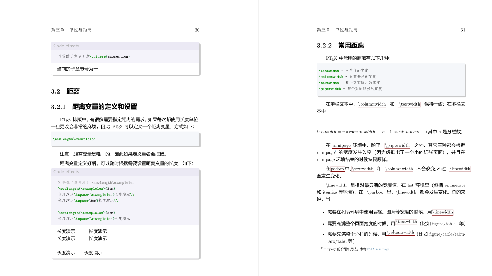
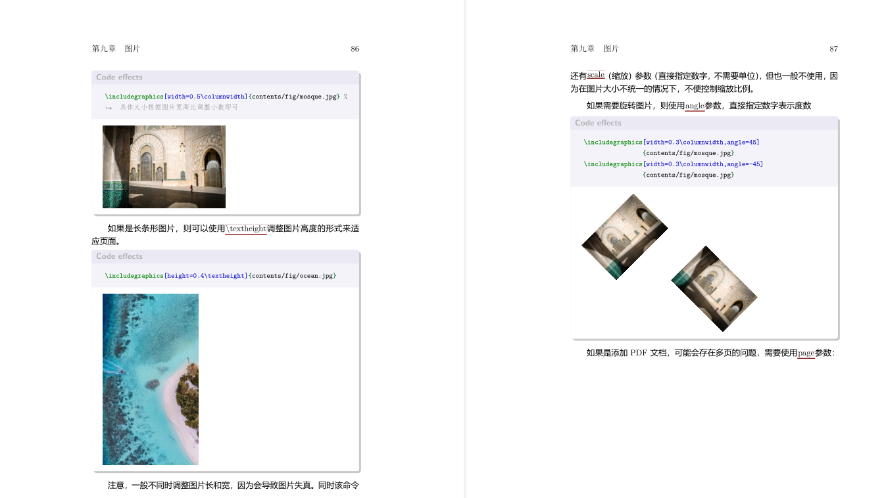

# LaTeXdoc
for LaTeX command quick learning and search.

> Download: [ver-0.7](https://github.com/sailist/LaTeXdoc/releases/download/0.7/LaTeX.pdf)

# Compile
clone repo to local dist
```
git clone --depth=1 https://github.com/sailist/LaTeXdoc
cd LaTeXdoc
```
then run:
```LaTeX
xelatex  -synctex=1 -interaction=nonstopmode -file-line-error -output-directory=./out --shell-escape LaTeXTutorial.tex

bibtex out/LaTeXTutorial.aux

xelatex  -synctex=1 -interaction=nonstopmode -file-line-error -output-directory=./out --shell-escape LaTeXTutorial.tex

xelatex  -synctex=1 -interaction=nonstopmode -file-line-error -output-directory=./out --shell-escape LaTeXTutorial.tex
```

# preview




